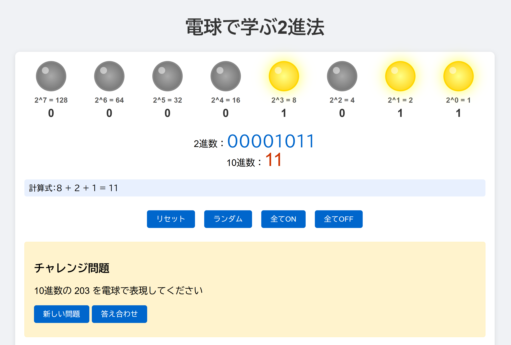

# 電球で学ぶ2進法アプリ

視覚的に2進法を学習できるインタラクティブなWebアプリケーションです。電球のオンオフで2進数を表現し、10進数との関係を直感的に理解できます。

下記のスクリーンショットでは2進数の`1011`を電球のオンオフで表現しています。

## 使い方

1. `index.html`をダウンロードする
2. ダウンロードしたファイルをWebブラウザで開く

## プロンプト

このアプリは、Claude 3.7 Sonnet (Anthropic)を用いて作成しました。プロンプト（AIへの指示）は以下の通りです。

1. JavaScriptで電球のオンオフで2進法を理解できるアプリを作って
2. 画面の幅に合わせて、8つの電球がすべて横に並ぶように調整して

## 特徴

- **視覚的な学習**: 8個の電球（8ビット）で2進数を表現
- **インタラクティブな操作**: クリックで電球のON/OFFを切り替え
- **リアルタイム変換**: 2進数と10進数の同時表示
- **計算過程の表示**: ビットごとの位置値と計算式を表示
- **チャレンジモード**: 10進数から2進数への変換練習問題
- **レスポンシブデザイン**: スマートフォンからデスクトップまで対応

## 機能詳細

### 1. 電球インターフェース
- 各電球は1ビットを表現（ON=1, OFF=0）
- 8ビットで0から255までの数値を表現可能
- クリックで簡単に切り替え

### 2. 数値表示
- 2進数表現（例：10011010）
- 10進数表現（例：154）
- 計算式（例：128 + 16 + 8 + 2 = 154）

### 3. 操作ボタン
- **リセット**: 全ての電球をOFFに
- **ランダム**: ランダムな2進数を生成
- **全てON**: 全ての電球をONに（255）
- **全てOFF**: 全ての電球をOFFに（0）

### 4. チャレンジモード
- ランダムな10進数が出題
- 電球で正しい2進数を表現
- 答え合わせ機能で学習効果を確認

### 5. 教育的要素
- 2進法の仕組みの説明
- 各ビットの位置値（2^n）の表示
- 実際の計算過程の可視化

## 技術仕様

- **言語**: HTML, CSS, JavaScript
- **フレームワーク**: なし（バニラJS）
- **対応ブラウザ**: モダンブラウザ全般
- **レスポンシブ対応**: あり
